---
## Front matter
title: "Отчёт по лабораторной работе 5"
subtitle: "Архитектура компьютеров"
author: "Султани Али НКАбд-06-24"

## Generic otions
lang: ru-RU
toc-title: "Содержание"

## Bibliography
bibliography: bib/cite.bib
csl: pandoc/csl/gost-r-7-0-5-2008-numeric.csl

## Pdf output format
toc: true # Table of contents
toc-depth: 2
lof: true # List of figures
lot: true # List of tables
fontsize: 12pt
linestretch: 1.5
papersize: a4
documentclass: scrreprt
## I18n polyglossia
polyglossia-lang:
  name: russian
  options:
	- spelling=modern
	- babelshorthands=true
polyglossia-otherlangs:
  name: english
## I18n babel
babel-lang: russian
babel-otherlangs: english
## Fonts
mainfont: PT Serif
romanfont: PT Serif
sansfont: PT Sans
monofont: PT Mono
mainfontoptions: Ligatures=TeX
romanfontoptions: Ligatures=TeX
sansfontoptions: Ligatures=TeX,Scale=MatchLowercase
monofontoptions: Scale=MatchLowercase,Scale=0.9
## Biblatex
biblatex: true
biblio-style: "gost-numeric"
biblatexoptions:
  - parentracker=true
  - backend=biber
  - hyperref=auto
  - language=auto
  - autolang=other*
  - citestyle=gost-numeric
## Pandoc-crossref LaTeX customization
figureTitle: "Рис."
tableTitle: "Таблица"
listingTitle: "Листинг"
lofTitle: "Список иллюстраций"
lotTitle: "Список таблиц"
lolTitle: "Листинги"
## Misc options
indent: true
header-includes:
  - \usepackage{indentfirst}
  - \usepackage{float} # keep figures where there are in the text
  - \floatplacement{figure}{H} # keep figures where there are in the text
---

# Цель работы

Целью работы является приобретение практических навыков работы в Midnight Commander. 
Освоение инструкций языка ассемблера mov и int.

# Теоретическое введение

Midnight Commander (или просто mc) — это мощный файловый менеджер, который предоставляет пользователям удобный способ навигации по структуре каталогов и выполнения основных операций с файлами в файловой системе. Эта программа значительно упрощает работу с файлами, делая её более интуитивной и визуально понятной.

Программа, написанная на языке ассемблера NASM, обычно состоит из трёх основных секций:
- **Секция кода программы (SECTION .text)**: здесь располагается исполняемый код.
- **Секция инициализированных данных (SECTION .data)**: в этой секции содержатся данные, известные на момент компиляции.
- **Секция неинициализированных данных (SECTION .bss)**: в этой секции резервируется память для данных, значения которых присваиваются во время выполнения программы.

# Выполнение лабораторной работы

## Знакомство с Midnight Commander

Запускаю Midnight Commander (см. рис. [-@fig:001]), используя клавиши со стрелками и Enter, перехожу в каталог `~/work/arch-pc`. Затем нажимаю F7 для создания нового каталога под названием `lab05` (см. рис. [-@fig:002]).

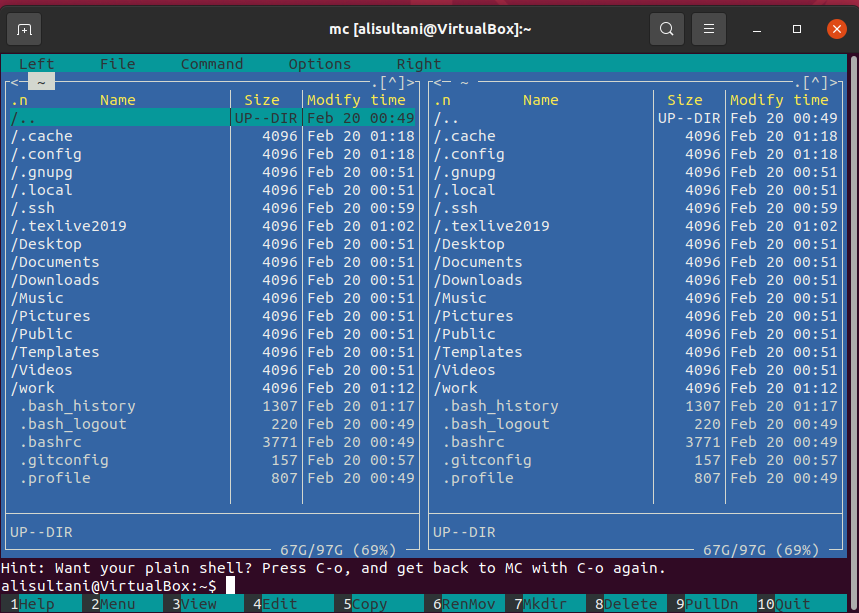{ #fig:001 width=70%, height=70% }

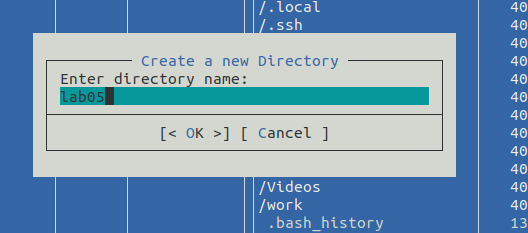{ #fig:002 width=70%, height=70% }

С помощью команды `touch` создаю файл `lab05-1.asm` (см. рис. [-@fig:003]).

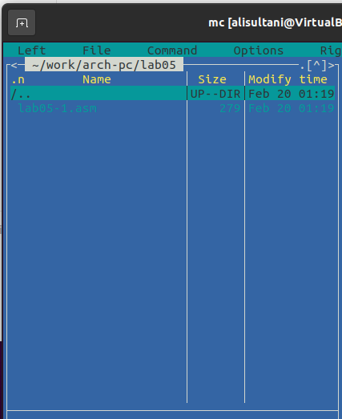{ #fig:003 width=70%, height=70% }

Открываю файл для редактирования, нажав F4, и выбираю редактор `mcedit`, после чего пишу код программы согласно заданию (см. рис. [-@fig:005]).

{ #fig:004 width=70%, height=70% }

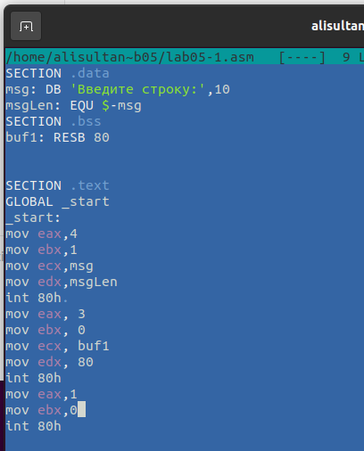{ #fig:005 width=70%, height=70% }

Для проверки содержимого файла открываю его на просмотр, нажав F3, и убеждаюсь, что код написан верно (см. рис. [-@fig:006]).

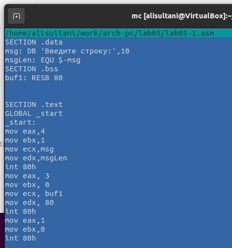{ #fig:006 width=70%, height=70% }

Транслирую файл программы в объектный файл, а затем выполняю компоновку, в результате чего получаю исполняемый файл программы (см. рис. [-@fig:007]).

{ #fig:007 width=70%, height=70% }

## Подключение внешнего файла in_out.asm

Скачиваю файл `in_out.asm` и размещаю его в рабочем каталоге (см. рис. [-@fig:008]). Для копирования файла использую клавишу F5, а для перемещения — клавишу F6.

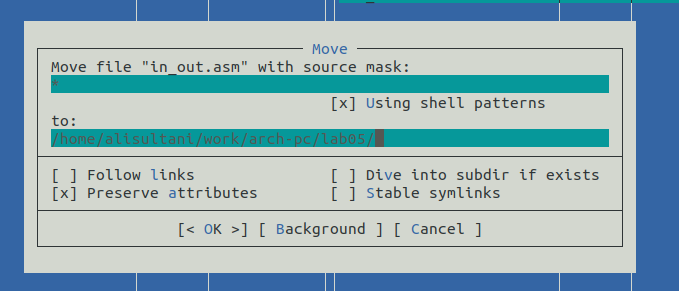{ #fig:008 width=70%, height=70% }

Копирую файл `lab05-1.asm`, создавая его копию под именем `lab05-2.asm` (см. рис. [-@fig:009]).

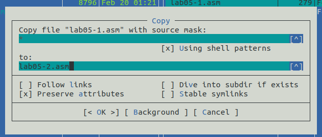{ #fig:009 width=70%, height=70% }

Пишу код для программы `lab05-2.asm`, используя подпрограммы из внешнего файла `in_out.asm` (см. рис. [-@fig:010]).

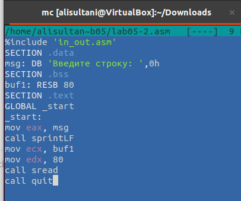{ #fig:010 width=70%, height=70% }

Компилирую программу и проверяю её запуск (см. рис. [-@fig:011]).

{ #fig:011 width=70%, height=70% }

В файле `lab05-2.asm` заменяю подпрограмму `sprintLF` на `sprint`. После этого заново собираю исполняемый файл (см. рис. [-@fig:012] и [-@fig:013]).

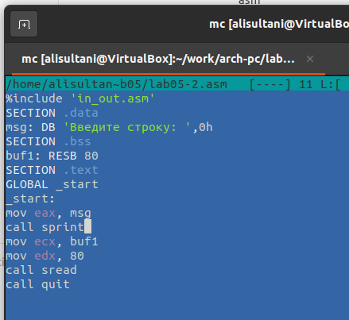{ #fig:012 width=70%, height=70% }

{ #fig:013 width=70%, height=70% }

Теперь программа выводит строку без перехода на новую строку в конце.

## Задание для самостоятельной работы

Копирую программу `lab05-1.asm` и модифицирую код, чтобы она работала по следующему алгоритму (см. рис. [-@fig:014] и [-@fig:015]):
- выводит приглашение "Введите строку:";
- принимает строку с клавиатуры;
- отображает введённую строку на экране.

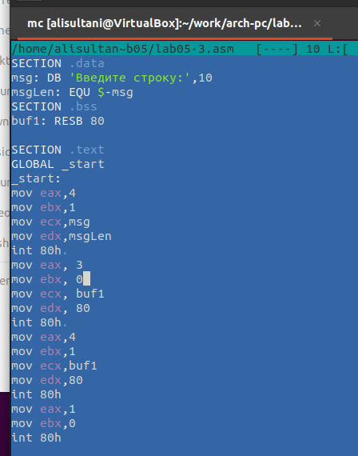{ #fig:014 width=70%, height=70% }

{ #fig:015 width=70%, height=70% }

Аналогично, копирую программу `lab05-2.asm` и изменяю код, теперь используя подпрограммы из файла `in_out.asm` (см. рис. [-@fig:016] и [-@fig:017]).

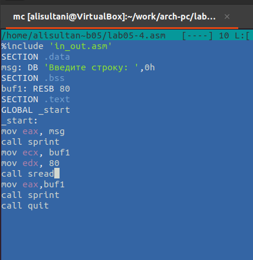{ #fig:016 width=70%, height=70% }

{ #fig:017 width=70%, height=70% }

# Выводы

Научились писать базовые ассемблерные программы. Освоили ассемблерные инструкции mov и int.